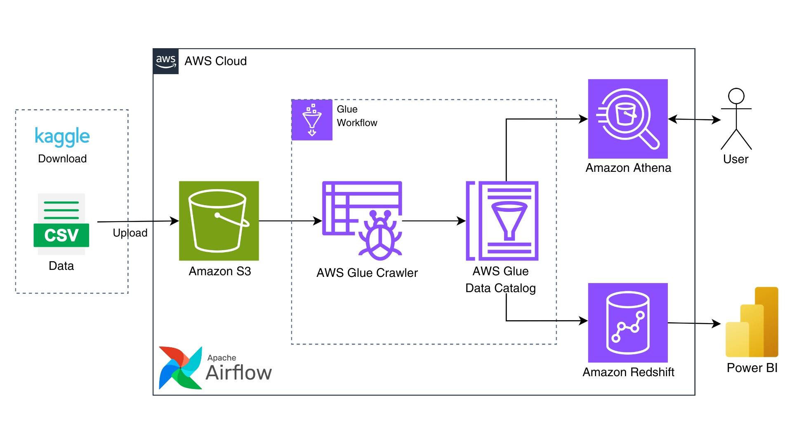
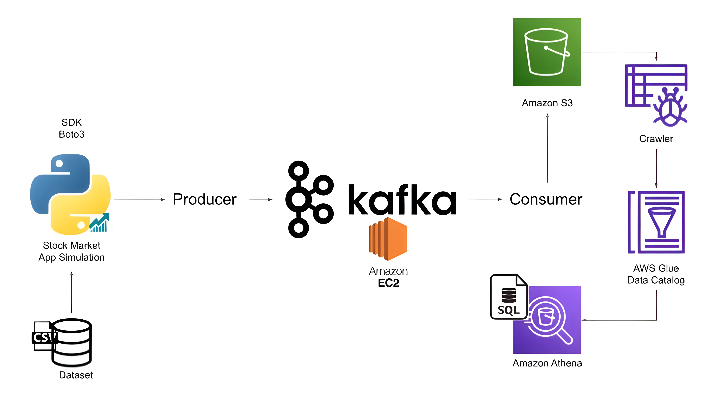
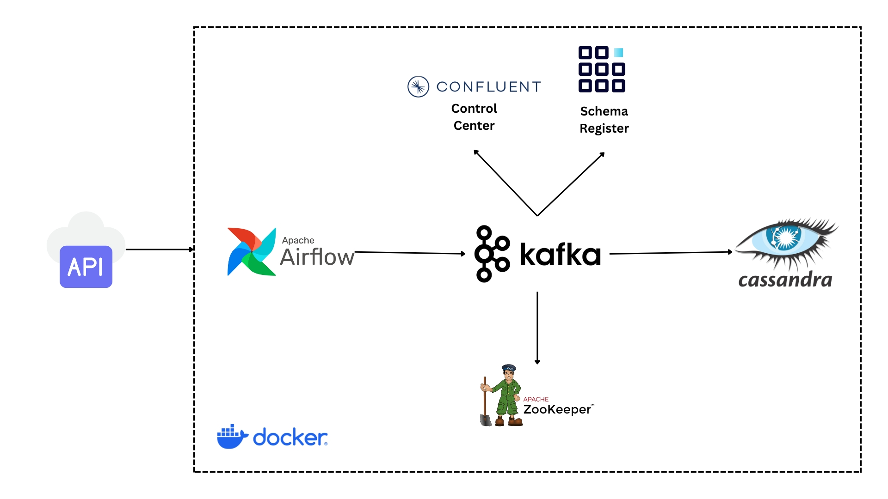

# Computer Science Student

## Contacts and Links
rj.acaac211@gmail.com | +639207005579 \
[LinkedIn](https://www.linkedin.com/in/rj-r-aca-ac-7a070b29a/) \
[GitHub](https://github.com/rjacaac211)

## Education
**BS Computer Science** | La Salle University | 2021 - Present

## Certificates
**IBM Data Analyst Professional Certificate** | Nov 2023 | [View Certificate](https://coursera.org/share/4bd141d4137f48ebf6dd781c67d4c432)\
**IBM Data Science Professional Certificate** | Apr 2024 | [View Certificate](https://coursera.org/share/aa116bbde7d81fba96bf719d84b7797d)\
**IBM AI Engineering Professional Certificate** | Jun 2024 | [View Certificate](https://coursera.org/share/4199b5a5c5a357f6393f0ff190a45ddd)\
**IBM Data Engineering Professional Certificate** | Sep 2024 | [View Certificate](https://coursera.org/share/5536170f1d713bf39386954039887cac)

## Work Experience
### **AI Prompt Evaluator**
Outlier | Freelance | Oct 2024 - Present
- Evaluated and analyzed AI-generated prompts and responses to ensure alignment with user intent and expectations.
- Conducted thorough assessments of truthfulness, instruction following, and overall quality of AI outputs.
- Provided constructive feedback on AI responses based on detailed evaluations, contributing to ongoing model refinement.
- Engaged in research and fact-checking to validate claims made in AI responses, ensuring high-quality outputs.

## Projects

### [**Customer Churn ETL Pipeline with AWS, Apache Airflow, and PowerBI**](https://github.com/rjacaac211/Customer-Churn-ETL-Pipeline-with-AWS-Airflow-and-PowerBI)

[View Project](https://github.com/rjacaac211/Customer-Churn-ETL-Pipeline-with-AWS-Airflow-and-PowerBI)
- Built a **customer churn ETL pipeline** using **AWS**, **Apache Airflow**, and **Power BI**.
- **Amazon S3** stores raw and processed data; **AWS Glue** handles schema inference and data transformation.
- **Apache Airflow** orchestrates ETL tasks from **S3** to **Amazon Redshift** and monitors Glue job execution.
- **Amazon Athena** enables querying of raw data, and **Amazon Redshift** serves as the data warehouse and data source for **Power BI**.
- **Power BI** provides interactive dashboard for customer churn insights.

### [**Real-Time Stock Market Data with Kafka and AWS**](https://github.com/rjacaac211/Real-Time-Stock-Market-Data-with-Kafka-and-AWS)

[View Project](https://github.com/rjacaac211/Real-Time-Stock-Market-Data-with-Kafka-and-AWS)
- Built a scalable **real-time data pipeline** for stock market data ingestion using **Apache Kafka** and **AWS S3**.
- Kafka producers stream stock data to a Kafka topic, while Kafka consumers process the data and write it to **AWS S3** as **JSON** files.
- Utilized **Python** for **Kafka** producer and consumer logic, managing **Kafka** services on an **EC2** instance.
- Integrated **AWS S3** for cloud storage and **AWS Glue / Athena** for data analysis.

### [**SpaceX Falcon 9 Landing Prediction**](https://github.com/rjacaac211/SpaceX-Falcon-9-Landing-Prediction)

[View Project](https://github.com/rjacaac211/SpaceX-Falcon-9-Landing-Prediction)
- Project aims to predict Falcon 9 first stage landings and identify influencing factors.
- Utilizes **data collection**, **EDA**, **interactive visualizations**, and **predictive modeling** techniques.
- Notebooks cover **API data collection**, **web scraping**, **SQL-based EDA**, and visualization with **Folium**.
- Interactive dashboard with **Plotly Dash** provides insights into launch success rates and payload outcomes.
- **Predictive analysis** selects the best-performing classification algorithm for landing predictions.

### [**Fashion MNIST Image Classification**](https://github.com/rjacaac211/Fashion_MNIST_Image_Classification)

[View Project](https://github.com/rjacaac211/Fashion_MNIST_Image_Classification)
- Implemented **image classification** on the Fashion MNIST dataset using **Convolutional Neural Networks (CNNs)** in both **PyTorch** and **TensorFlow**.
- The Fashion MNIST dataset consists of 70,000 images of fashion items categorized into 10 classes.
- Developed **CNN** models with two convolutional layers, max pooling, fully connected layers, and dropout for regularization in both **PyTorch** and **TensorFlow** implementations.
- Trained the models using stochastic gradient descent (SGD) over multiple epochs.
- Evaluated model performance on a validation set, achieving **classification accuracies of over 90%** for both models.

### [**Tech Trend Analysis**](https://github.com/rjacaac211/Tech-Trend-Analysis)

[View Project](https://github.com/rjacaac211/Tech-Trend-Analysis)
- Analyzes technology trends using survey data.
- Explores current landscape of technology usage, preferences, and demographics.
- Utilizes **data collection**, **exploration**, **wrangling**, **analysis**, and **visualization** techniques.
- Provides insights into key technology trends and their implications for decision-making.
- Includes detailed notebooks for each stage of the analysis, a **dashboard** for visualizing the current and future technology usage and demographics, and a **comprehensive report** summarizing the findings.

### [**Real-Time Data Streaming with Apache Kafka, Cassandra, and Airflow**](https://github.com/rjacaac211/Real-Time-User-Data-with-Airflow-Kafka-Cassandra)

[View Project](https://github.com/rjacaac211/Real-Time-User-Data-with-Airflow-Kafka-Cassandra)
- Developed a **real-time data streaming pipeline** utilizing **Apache Kafka** for data ingestion, **Apache Cassandra** for resilient data storage, and **Apache Airflow** for workflow orchestration.
- Utilizes **Airflow** to manage task scheduling and execution, ensuring data is processed and stored seamlessly.
- Features full containerization using **Docker**, enhancing the scalability and fault tolerance of the pipeline.
- The entire system's performance and health can be monitored through **Airflow's web interface** and **Kafka’s Control Center**.

### [**Chicago Data Analysis with SQL**](https://github.com/rjacaac211/Chicago-Data-Analysis-with-SQL)

[View Project](https://github.com/rjacaac211/Chicago-Data-Analysis-with-SQL)
- Analyzes various aspects of Chicago using **SQL** queries.
- Leverages datasets covering crime, socioeconomic indicators, and public schools.
- Applies **data aggregation**, **filtering**, **subqueries**, and **advanced analytics**.
- Utilizes **advanced SQL** techniques such as **joins**, **views**, **procedures**, and **transactions**.
- Emphasizes understanding dataset structure and defining clear analytical objectives.
- Provides valuable insights into Chicago's characteristics and issues using **SQL analysis**.

### [**CRM Sales Dashboard with Google Sheets**](https://github.com/rjacaac211/CRM-Sales-Dashboard-with-Google-Sheets)

[View Project](https://github.com/rjacaac211/CRM-Sales-Dashboard-with-Google-Sheets)
- **Data Preparation:** Conducted data QA and profiling on the sales pipeline dataset. Joined the sales team data to add information such as managers and regional offices for each sales agent.
- **Pivot Table Analysis:** Created **pivot tables** to analyze sales trends by quarter, track won and lost opportunities, and assess sales agent performance, ranking them by opportunities won.
- **Dynamic Dashboard:** Developed an **interactive dashboard** using **charts**, including a **scorecard**, **pie chart**, and **bar chart**, with **filters** for regional offices and managers. The dashboard allows users to track quarterly performance and agent success.

### [**Car Sales Data Analysis with Excel and Cognos Analytics**](https://github.com/rjacaac211/Car-Sales-Data-Analysis-with-Excel-and-Cognos-Analytics)

[View Project](https://github.com/rjacaac211/Car-Sales-Data-Analysis-with-Excel-and-Cognos-Analytics)
- Analyzed car sales data to derive insights on dealership performance, model profitability, and sales trends.
- Built **pivot tables** and **visualizations** in **Excel** to explore quantity sold, profit by dealer, and seasonal trends.
- Developed a **Cognos Analytics Dashboard** to visualize sales, profit, recalls, and customer sentiment.
- Identified top-performing dealers and models, with Dealer 1288 and the Labrador model leading in profitability.
- Provided insights into customer sentiment, revealing high levels of positive feedback despite product recalls.
