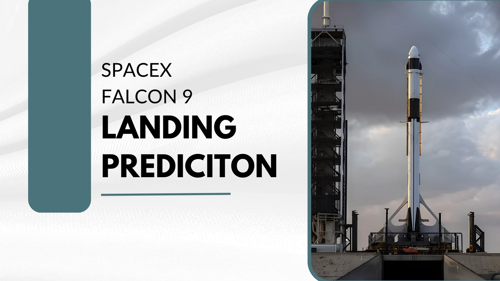
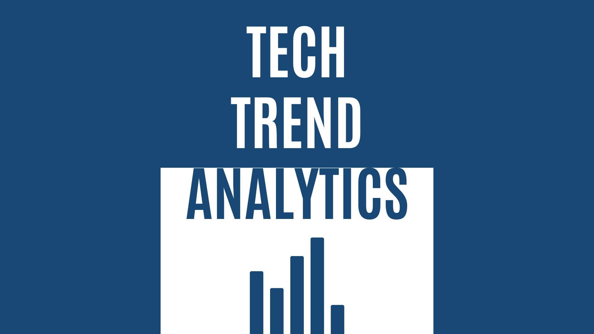
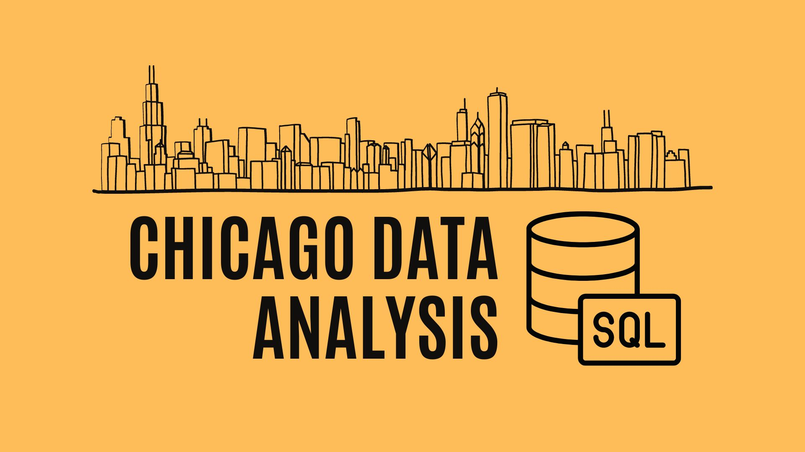
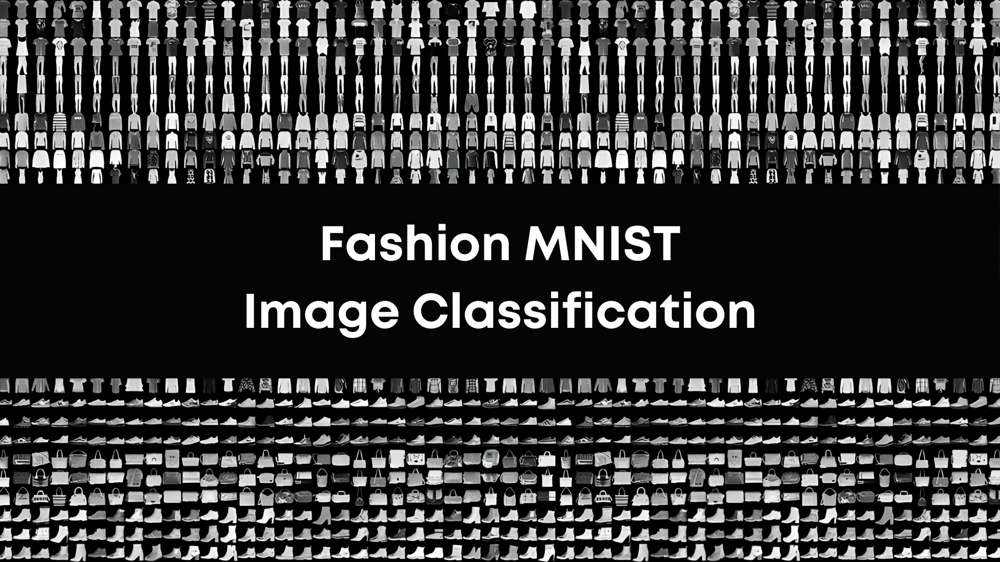

# Computer Science Student

## Education
BS Computer Science | La Salle University | Aug 2021 - Present

## Certifications
IBM Data Analyst Professional Certificate | Nov 2023\
[View Certificate](https://coursera.org/share/4bd141d4137f48ebf6dd781c67d4c432)

IBM Data Science Professional Certificate | Apr 2024\
[View Certificate](https://coursera.org/share/aa116bbde7d81fba96bf719d84b7797d)

## Projects

### [**SpaceX Falcon 9 Landing Prediction**](https://github.com/rjacaac211/SpaceX-Falcon-9-Landing-Prediction)

[View Project](https://github.com/rjacaac211/SpaceX-Falcon-9-Landing-Prediction)
- Project aims to predict Falcon 9 first stage landings and identify influencing factors.
- Utilizes data collection, EDA, interactive visualizations, and predictive modeling techniques.
- Notebooks cover API data collection, web scraping, SQL-based EDA, and visualization with Folium.
- Interactive dashboard with Plotly Dash provides insights into launch success rates and payload outcomes.
- Predictive analysis selects the best-performing classification algorithm for landing predictions.

### [**Tech Trend Analysis**](https://github.com/rjacaac211/Tech-Trend-Analysis)

[View Project](https://github.com/rjacaac211/Tech-Trend-Analysis)
- Analyzes technology trends using survey data.
- Explores current landscape of technology usage, preferences, and demographics.
- Utilizes data exploration, wrangling, analysis, and visualization techniques.
- Provides insights into key technology trends and their implications for decision-making.
- Includes detailed notebooks for each stage of the analysis and a comprehensive report summarizing the findings.

### [**Chicago Data Analysis with SQL**](https://github.com/rjacaac211/Chicago-Data-Analysis-with-SQL)

[View Project](https://github.com/rjacaac211/Chicago-Data-Analysis-with-SQL)
- Analyzes various aspects of Chicago using SQL queries.
- Leverages datasets covering crime, socioeconomic indicators, and public schools.
- Applies data aggregation, filtering, subqueries, and advanced analytics.
- Utilizes advanced SQL techniques such as joins, views, procedures, and transactions.
- Emphasizes understanding dataset structure and defining clear analytical objectives.
- Provides valuable insights into Chicago's characteristics and issues using SQL analysis.

### [**Fashion MNIST Image Classification**](https://github.com/rjacaac211/Fashion_MNIST_Image_Classification)

[View Project](https://github.com/rjacaac211/Fashion_MNIST_Image_Classification)
- Implemented image classification on the Fashion MNIST dataset using a CNN in PyTorch.
- Fashion MNIST dataset comprises 70,000 images of fashion items categorized into 10 classes.
- Developed a CNN model with two convolutional layers, max pooling, fully connected layers, and dropout.
- Trained the model using stochastic gradient descent (SGD) over multiple epochs.
- Evaluated model performance on a validation set, achieving a classification accuracy of 92%.
- _TensorFlow Implementation (Upcoming)_
