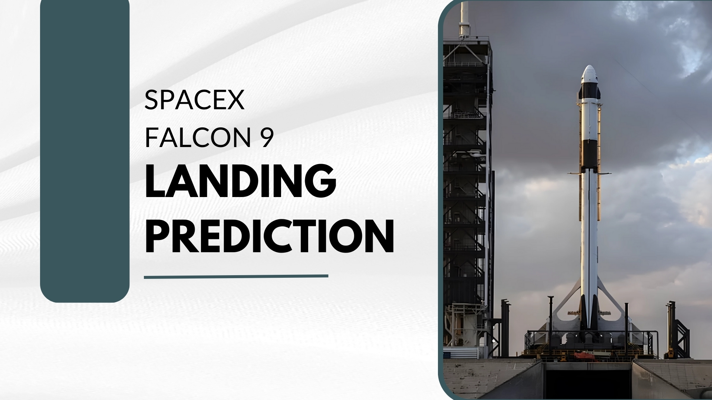

# Computer Science Student

## Education
BS Computer Science | La Salle University (Aug 2021 - Present)

## Projects
### [**Tech Trend Analysis**](https://github.com/rjacaac211/Tech-Trend-Analysis)

[View Project](https://github.com/rjacaac211/Tech-Trend-Analysis)
- Analyzes technology trends using survey data.
- Explores current landscape of technology usage, preferences, and demographics.
- Utilizes data exploration, wrangling, analysis, and visualization techniques.
- Provides insights into key technology trends and their implications for decision-making.
- Includes detailed notebooks for each stage of the analysis and a comprehensive report summarizing the findings.

### [**Chicago Data Analysis with SQL**](https://github.com/rjacaac211/Chicago-Data-Analysis-with-SQL)

[View Project](https://github.com/rjacaac211/Chicago-Data-Analysis-with-SQL)
- Analyzes various aspects of Chicago using SQL queries.
- Leverages datasets covering crime, socioeconomic indicators, and public schools.
- Applies data aggregation, filtering, subqueries, and advanced analytics.
- Utilizes advanced SQL techniques such as joins, views, procedures, and transactions.
- Emphasizes understanding dataset structure and defining clear analytical objectives.
- Provides valuable insights into Chicago's characteristics and issues using SQL analysis.

### [**SpaceX Falcon 9 Landing Prediction**](https://github.com/rjacaac211/SpaceX-Falcon-9-Landing-Prediction)

[View Project](https://github.com/rjacaac211/SpaceX-Falcon-9-Landing-Prediction)

_(Ongoing)_

### **Data Professional Survey with Power BI**
_(Upcoming)_

### **Fashion MNIST Image Classification**
_(Upcoming)_
